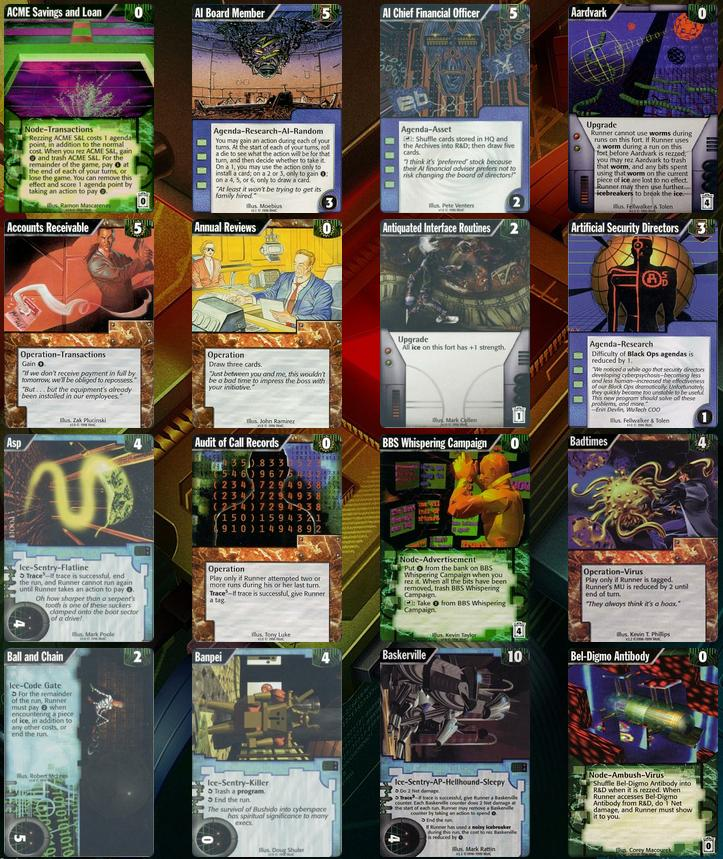

# Goal

Convert the ONR cards into a format usable by ~~Jinteki~~ a teki style website. 

The cards will be placed under the factions "onr_corp" and "onr_runner", and all the card titles will be prefaced by "onr_" to maintain compatability.

Types will be mapped to the android: netrunner counterparts, and two new IDs will be added.

### Proof of Concept


### TODO
I still need to actually seperate the cards by set, add in an onr format and onr factions, and a format containing only onr cycles. I can modify the edn files, but I suspect there's a bit more than needs to be done for this to come through.

### Workflow/Road-map

* ~~scrape data from emergency shutdown~~
* ~~scrape card images from emergency shutdown~~
* seperate cards by set
* ~~map card representations into identical formats/types as jinteki representations~~
  * ~~map agendas~~
  * ~~map assets~~
  * ~~map operations~~
  * ~~map ice~~
  * ~~map upgrades~~
  * ~~map events~~
  * ~~map programs~~
  * ~~map hardware~~
  * ~~map resources~~
* ~~insert onr factions into data~~
* ~~insert onr cycles into data~~
* ~~insert onr sets into data~~
* ~~insert all the new subtypes into data~~
* ~~add card entries in edn/set-cards (these are created, automate placement)~~
* ~~add the actual card entries into the edn/cards folder~~
* ~~automate all of this so that it can be realistically done on any release of netrunner-data~~
* ~~add in onr identities~~
* add in onr format containing only onr cycles

Then later, do:
* split the cards into the representative sets (base, proteus, classic)
* add images for the ONR identities
* ~~add illustrator information back in~~

To convert, use the `onr_setup.sh` script.

Then, from your netrunner(teki) directory, run: 

```
cp path/to/netrunner-data-onr/onr_out/images/*.png resources/public/img/cards/en/default/stock/.
lein fetch -l ../netrunner-data-onr
```

When you run jinteki (lein repl), then it should contain all of the ONR cards (note that none of them will have functional implementations - that's the next project)

To figure out how to use the data, refer to https://github.com/mtgred/netrunner/issues/6202

# netrunner-cards-edn

The clojure app is internal only, p much. If you want the edn data, look under `/edn`.
This app only transforms that data into a jnet-usable format.
